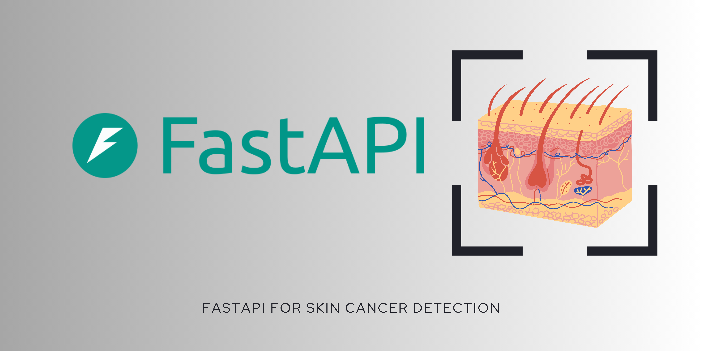

# Skin Cancer Detection API

This FastAPI-based application allows users to upload skin images and detect whether skin cancer is present or not. The API uses a deep learning model to classify images and provides the results with accuracy levels.

## Table of Contents
- [Features](#features)
- [Installation](#installation)
- [Usage](#usage)
- [Endpoints](#endpoints)
- [Project Structure](#project-structure)
- [Technologies Used](#technologies-used)
                    
## Features
- Upload skin images for cancer detection.
- Predicts whether the image indicates skin cancer and specifies the type.
- Provides confidence levels for the predictions.

## Installation

1. **Clone the Repository:**
   ```bash
   git clone https://github.com/your-username/skin-cancer-detection-api.git
   ```
2. **Navigate to the Project Directory:**
   ```bash
   cd skin-cancer-detection-api
   ```
3. **Set Up a Virtual Environment (Optional but Recommended):**
   ```bash
   python -m venv venv
   source venv/bin/activate  # On Windows use `venv\Scripts\activate`
   ```
4. **Install the Dependencies:**
   ```bash
   pip install -r requirements.txt
   ```

## Usage

1. **Run the API:**
   ```bash
   uvicorn main:app --reload
   ```
   The API will be available at `http://127.0.0.1:8000`.

2. **Access the Documentation:**
   - Swagger UI: [http://127.0.0.1:8000/docs](http://127.0.0.1:8000/docs)
   - ReDoc: [http://127.0.0.1:8000/redoc](http://127.0.0.1:8000/redoc)

## Endpoints

- `POST /predict`: Upload an image file for prediction.
  - **Request:** Form-data with image file.
  - **Response:** JSON object with prediction results and accuracy.

## Project Structure
```
skin-cancer-detection-api/
│
├── main.py                # Main application file
├── skin_cancer_model.h5   # skin cancer model file
├── requirements.txt       # List of dependencies
├── README.md              # Project documentation
└── .gitignore             # Git ignore file
```

## Technologies Used
- **FastAPI:** Web framework for building APIs.
- **TensorFlow/Keras:** Deep learning framework for building the detection model.
- **Python:** Programming language.

1. Fork the repository.
2. Create a new branch (`git checkout -b feature-branch`).
3. Commit your changes (`git commit -m 'Add some feature'`).
4. Push to the branch (`git push origin feature-branch`).
5. Open a Pull Request.
                      
